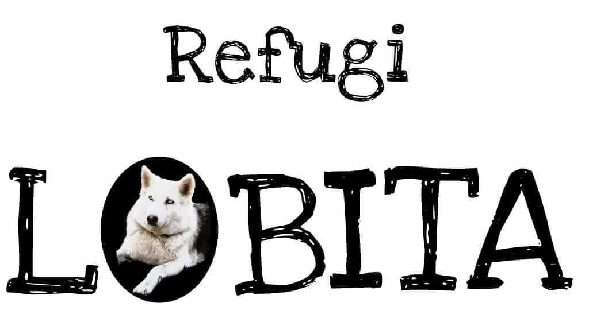

# Projecte Refugi Lobita

## Autors:
- Eduard Iglesies
- Iban Cervera
- Esther Pont
- Susana Garcia

## Introducció

Projecte Refugi Lobita és un projecte per un refugi d'animals on es poden veure els diferentes animals que té el refugi, i els usuaris registrats poden realitzar donacions, apadrinar animals, o adoptarlos.

## Funcionalitats
- **Noticies**: Al entrar al web, es mostraran les noticies destacades del Refugi.
- **Adoptar animals**: Els usuaris registrats, podran adoptar els animals que apareixen al web.
- **Apadrinar animals**: Els usuaris registrats, podran apadrinar a diferents animals que apareixen al web.
- **Donacions**: Els usuaris registrats podran realitzar donacions al refugi, per al manteniment dels animals.

## Tecnologies

- Frontend: Html , CSS ,  Javascript 

- Backend: Spring Boot 

- Database: MySQL 

## Arquitectura

Aquest projecte fa servir una arquitectura del tipus RESTful API (Respresentational State Transfer), un estil d'arquitectura àmpliament utilitzat per a sistemes distribuïts que interactuen a través de la web.
Aquesta arquitectura es basa en l'us de recursos identificats mitjançant URLs i en la transferencia de representacions d'aquests recursos a través del protocol HTTP.

Les funcions bàsiques d'una API RESTful es basen en els mètodes estàndar d'HTTP, que permeten realitzar operacions sobre els recursos disponibles. Aquestes funciones inclouen:
1. **GET**: Recuperar informació d'un recurs específic. Per exemple, obtenir la llista d'animals, o d'un animal en concret.
2. **POST**: Crear un nou recurs. Per exemple, afegir un nou animal al sistema.
3. **PUT**: Actualitzar un recurs existent. Per exemple, modificar els detalls d'un animal creat previament.
4. **DELETE**: Eliminar un recurs especific. Per exemple, esborrar un animal del sistema.
5. **PATCH**: Actualitzar parcialment un recurs, utilitzat per a canvis específics sense modificar tot el recurs.

En seguir els principis REST, aquesta arquitectura ofereix característiques clau com ara:
- **Escalabilitat**: Els clients i els servidors estan desacoblats, cosa que facilita el creixement del sistema.
- **Simplicitat**: L'ús d'estàndards com HTTP i JSON permet una integració i comprensió senzilles.
- **Portabilitat**: Els recursos són fàcilment accessibles des de diferents plataformes i dispositius.

---
La estructura del projecte es la següent:
- **Frontend**: https://github.com/susangn50/ProjecteRefugiLobita
  Aqui trobarem el html,css i javascript.
- **Backend**: https://github.com/susangn50/ProjecteRefugiLobitaJavaSpring
  Aquí trobarem l'aplicació Spring Boot.

  
